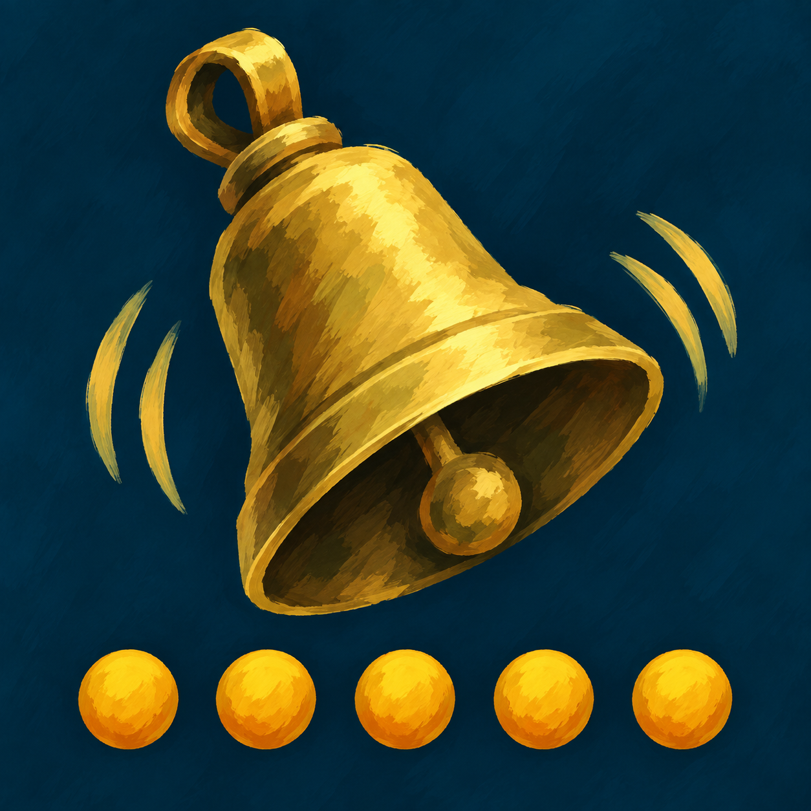

# ResourceDing

A small World of Warcraft addon that plays one sound when your class finisher resource reaches maximum.

It is useful when you are watching the fight instead of the resource bar: build five Combo Points, hear the cue, use a finisher. It only fires on the transition to full, so it does not repeat until you spend some resource and fill it again.

It also shows the points as dots under the target's nameplate, filling as you build them. On WoW Forever the count is hidden from addons in combat; each dot is a small bar the game fills itself, so the dots work in combat too.

For casters: a warlock on the Classic game (Classic Era, Forever) hears a Soul Shard come in and sees the shards as purple diamonds in the same place, and any caster can have a sound when mana climbs to a level: 80% for a warlock, who takes the rest with Life Tap, 100% for others. Mana is only read while the game shows it.

## Supported resources

- Rogue and Feral Druid — Combo Points
- Monk — Chi *(Retail)*
- Paladin — Holy Power *(Retail)*
- Warlock — Soul Shards *(Retail)*
- Arcane Mage — Arcane Charges *(Retail)*
- Evoker — Essence *(Retail)*

Unsupported specs remain silent automatically.

On Classic Era only combo points exist. Chi, Holy Power, Arcane Charges and the
Soul Shard bar all arrived with later expansions, and Monk and Evoker are not in
that game at all, so `Core.lua` drops every entry but Rogue and Druid when it
loads there — the settings never offer a resource the client cannot have.

WoW Forever is that same game on the Retail client, which reports itself as
Retail and loads the Retail manifest. The addon goes by the client's version
instead (1.60.x) and behaves as it does on Classic Era. That game also keeps
the combo point count secret from addons during a fight, so there the addon
reads the game's own combo point display -- which points are lit -- rather
than the number.

## Settings

Open **Esc → Options → AddOns → ResourceDing** or type `/rding`.

- Enable/disable
- Combat-only mode (enabled by default)
- Auction House, Ready Check, Quest Complete, Level Up, Bell, Coins, and Raid Warning sounds
- Test sound button
- Combo point dots under the target's nameplate, their size and distance below the health bar
- Soul Shards: the sound when one comes in, and the purple diamonds
- Mana: the sound at a level you choose, with its own sound

The panel follows the game: it shows the resource your current spec actually
uses and updates when you change spec or form. **Defaults** restores the saved
settings.

`/rding test`, `/rding on`, `/rding off` are also available.

Retail 12.1 and WoW Forever share one manifest (`Interface 120100, 16001`);
Classic Era 1.15.9 has its own (`11509`). MIT licence.
